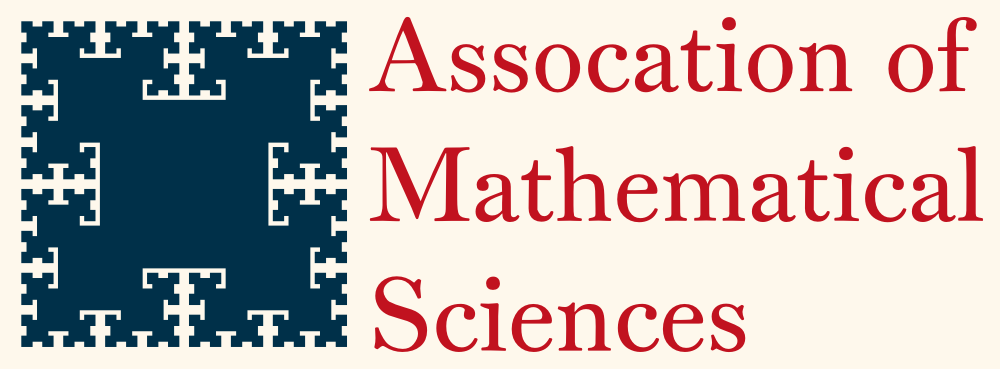

<picture>
  <source media="(prefers-color-scheme: dark)" srcset="./public/logos/dark_banner.png">
  <source media="(prefers-color-scheme: light)" srcset="./public/logos/light_banner.png">
  
</picture>

# Stevens Mathematical Club official website

The SMC-Dev team is soley responsible for all code and updates that are made towards this repository, only members of this team are allowed to make contributions.

## Instructions for contributing

1. First `git clone` the repository

    ```sh
    git clone https://github.com/Association-of-Mathematical-Sciences/SMS-Web.git
      ```

2. Install dependencies:

    ```sh
    npm install
    ```

3. Depending on the task or sub-project, you must make a new branch, here are the rules defined for each type:
    - `feature/*` ---> Adding new features to the website, components, pages, etc.
    - `content/*` ---> Updating the events and journal pages, any new research journal or event should be done using this branch.
    - `fix/*` ---> Any bug fixes regarding anything associated with the site.
    - `style/*` ---> Pure style changes, any change the affects the look of the site (Tailwind CSS, Dark/Light mode, etc.).

    You can make a branch like so in your local terminal within the folder that contains the project you just cloned:

    ```sh
    git checkout -b feature/new_feature
    ```

    This will create a new branch `feature/new_feature` and set your development branch to that. To go back to main, or to switch to any other branch you may have, do `git checkout branch_name`.

4. After making your changes and committing them to your branch, please submit a **pull request** towards the repository. An E-Board member will review it and merge.

### Credits

Original authors of this repostory are Joshua Hizgiaev and Erik Hoxhaj.
